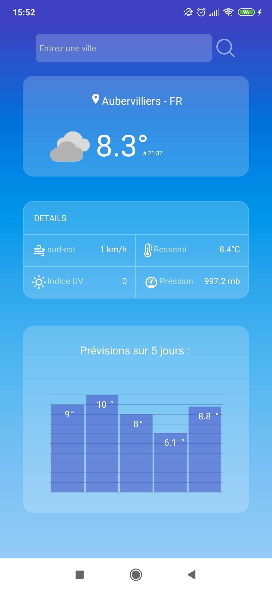
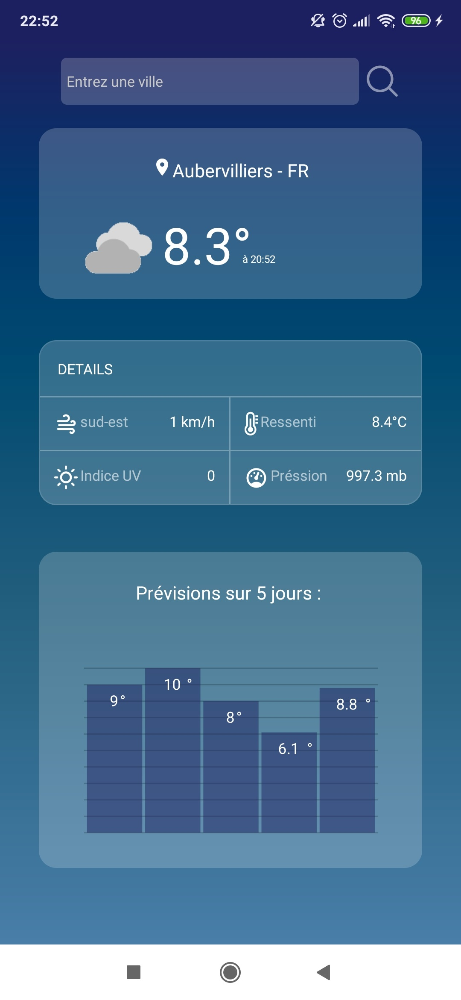

<h1 align="center">
my-weather
</h1>

  Application météorologique hybride dévelopée en React Native 

    

---
## Contexte

Il s'agit d'un projet de programmation mobile dans le cadre de ma première année de cycle d'ingénieur à l'ESIEA

---

## Fonctionnalités de l'application

<ul>
    <li>Utilisation de la géolocalisation de l'appareil</li>
    <li>Requêtes vers l'API WeatherBit avec Axios</li>
    <li>Affichage de la météo du jour avec détails</li>
    <li>Affichage sous forme de graphique des prévisions sur 5 jours</li>
</ul>

---

## Aperçu

  Thème sombre : 
     
  Thème clair : 
    

  

---

## Setup

<i>Disclaimer : these are the instructions to run it on your phone using a cable connected to the computer, you may change these using how you want to run the project.</i>
<i>Attention : ce sont les instruction pour lancer l'application sur votre téléphone connecté via un câble usb à votre ordinateur.</i>

<ol>
    <li>Assurez-vous d'avoir Node.js et Expo-cli intallés sur votre ordinateur</li>
    <li>A la racine du projet, entrez la commande <strong>npm install</strong> afin d'intaller toutes les dépendances manquantes</li>
    <li>Entrez la commande <strong>npm start</strong> à la racine du projet</li>
    <li>Dans ce même terminal, une fois le QRCode généré, vous pouvez taper sur la touche correspondante à l'action souhaitée ou scannez le QR directement via l'application Expo de votre téléphone afin de démarrer l'application </li>
    <li>You‘re good to go !</li>
</ol>

---

## Technologies utilisées

**Back-end** : Node.JS Axios  
**Front-end** : React Native w/ Redux  
**Database** : Weatherbit API  

---

## Architecture of the project

Le projet utilise une architecture **MVC**
<ul>
    <li>Modèle : L'API qui nous fournis les données (WeatherBit)</li>
    <li>Vue : Ce que l'utilisateur voit lorsqu'il accède à l'application dans le répertoire /src/containers</li>
    <li>Controlleur : Partie Serveur du projet dans le fichier actions/apiActions.js qui fais la Passerelle entre le modèle et la vue</li>
</ul>
